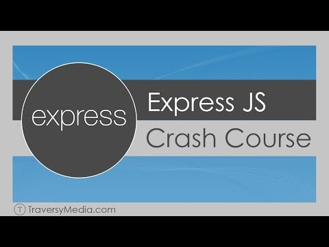

# Express Crash Course

> Code along project was done with the express crash course.
> [](https://www.youtube.com/watch?v=L72fhGm1tfE&t=287s)


## Study subjects

- Setup & Install / Simple Server
- Simple API
- Routes, Request & Response
- Express Router
- Static Files
- Template Engine Setup With Views
- Middleware
- Nodemon

## Quick Start

```bash
# Install dependencies
npm install

# Serve on localhost:5000
npm run dev
```
